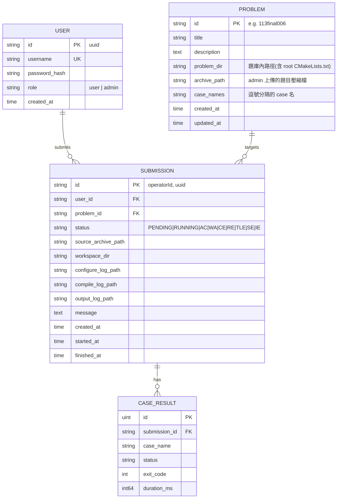

# 資料庫 ERD

## 說明

- **USER**:`role` 僅 `user` / `admin` 入庫;未帶 JWT 即視為 Guest(不入庫)。密碼以 bcrypt 雜湊。
- **PROBLEM**:`id` 即題目代號,亦為 CMake `project()` 名稱與執行檔前綴 `<project>-<case>`。
  題庫目錄含 root `CMakeLists.txt`、`cmake/AddJudge.cmake`、`spec/case*.h`。
- **SUBMISSION**:`id` 對應 PRD 的 `operatorId`。三段日誌以實體檔案儲存,DB 只存路徑。
  狀態機:`PENDING → RUNNING → {AC|WA|CE|RE|TLE|SE}`;系統錯誤為 `IE`。
- **CASE_RESULT**:每個提交對每個 case 一列;`OnDelete:CASCADE` 隨提交刪除。重跑前會清除舊列。
